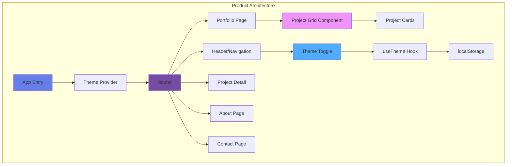
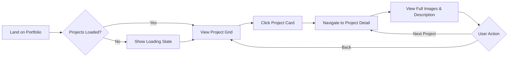
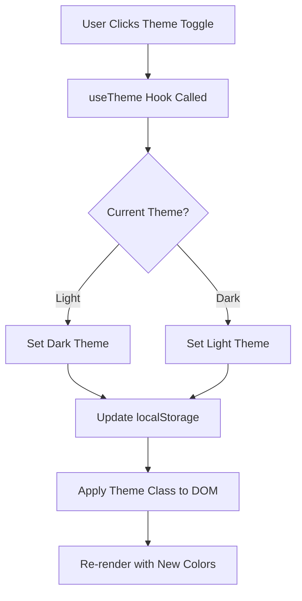
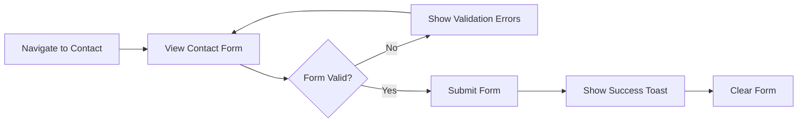
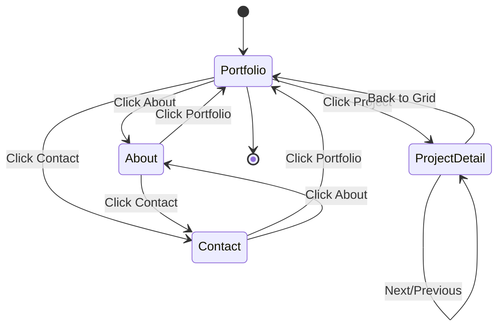

# Photography Portfolio

> Built with [Shape.town](https://shape.town) + Ally

## Product Overview

A minimal, elegant photography portfolio showcasing project work with dark/light theme support and responsive design.



## User Flows

### 1. Browse Projects Flow


### 2. Theme Toggle Flow


### 3. Contact Flow


### 4. Navigation Flow


## Key Features

- **Responsive Grid Layout**: Projects displayed in adaptive 1-3 column grid
- **Theme Switching**: Persistent dark/light mode with smooth transitions
- **Project Details**: Full-screen image galleries with descriptions
- **Contact Form**: Validated form with success/error feedback
- **Navigation**: Clean header with active route highlighting

## Tech Stack

| Technology | Version | Purpose |
|------------|---------|---------|
| React | 19 | UI framework with hooks |
| Vite | 7 | Build tool + HMR |
| TypeScript | 5.9 | Strict type checking |
| Tailwind CSS | 4 | Utility-first styling |
| Radix UI | Latest | Accessible primitives |
| Lucide React | Latest | Icon library |

## Quick Start

```bash
npm install
npm run dev
```

## Project Structure

```
src/
├── app.tsx              # Main app with routing
├── main.tsx             # Entry point
├── components/
│   ├── ui/              # Reusable UI components
│   │   ├── button.tsx   # Button with variants
│   │   ├── card.tsx     # Card container
│   │   ├── input.tsx    # Form input
│   │   ├── label.tsx    # Form label
│   │   ├── select.tsx   # Dropdown select
│   │   ├── textarea.tsx # Multi-line input
│   │   ├── table.tsx    # Data table
│   │   ├── badge.tsx    # Status badges
│   │   ├── avatar.tsx   # User avatar
│   │   ├── tooltip.tsx  # Hover tooltips
│   │   ├── dropdown-menu.tsx  # Context menus
│   │   ├── sidebar.tsx  # Navigation sidebar
│   │   ├── separator.tsx # Visual dividers
│   │   └── sonner.tsx   # Toast notifications
│   ├── icons.tsx        # Icon registry (50+ icons)
│   └── providers/
│       └── theme.tsx    # Dark/light theme
├── lib/
│   └── utils.ts         # cn() helper
└── styles/
    └── global.css       # Tailwind + theme vars
```

## Available Components

### Button
```tsx
import { Button } from '@/components/ui/button';

<Button variant="default">Primary</Button>
<Button variant="secondary">Secondary</Button>
<Button variant="outline">Outline</Button>
<Button variant="ghost">Ghost</Button>
<Button variant="destructive">Destructive</Button>
<Button variant="link">Link</Button>
<Button size="sm">Small</Button>
<Button size="lg">Large</Button>
<Button size="icon"><Icons.plus /></Button>
```

### Icons
```tsx
import { Icons } from '@/components/icons';

<Icons.home className="h-5 w-5" />
<Icons.user className="h-5 w-5" />
<Icons.settings className="h-5 w-5" />
<Icons.spinner className="h-5 w-5 animate-spin" />
```

### Form Components
```tsx
import { Input } from '@/components/ui/input';
import { Label } from '@/components/ui/label';
import { Textarea } from '@/components/ui/textarea';
import { Select, SelectTrigger, SelectValue, SelectContent, SelectItem } from '@/components/ui/select';

<Label htmlFor="email">Email</Label>
<Input id="email" type="email" placeholder="you@example.com" />

<Select>
  <SelectTrigger><SelectValue placeholder="Select..." /></SelectTrigger>
  <SelectContent>
    <SelectItem value="a">Option A</SelectItem>
    <SelectItem value="b">Option B</SelectItem>
  </SelectContent>
</Select>
```

### Sidebar
```tsx
import { SidebarProvider, Sidebar, SidebarHeader, SidebarContent, SidebarNav, SidebarNavItem, SidebarTrigger } from '@/components/ui/sidebar';

<SidebarProvider>
  <Sidebar>
    <SidebarHeader>Logo</SidebarHeader>
    <SidebarContent>
      <SidebarNav>
        <SidebarNavItem icon={<Icons.home />} isActive>Home</SidebarNavItem>
        <SidebarNavItem icon={<Icons.settings />}>Settings</SidebarNavItem>
      </SidebarNav>
    </SidebarContent>
  </Sidebar>
  <main>
    <SidebarTrigger /> {/* Toggle button */}
    {/* Content */}
  </main>
</SidebarProvider>
```

### Table
```tsx
import { Table, TableHeader, TableBody, TableRow, TableHead, TableCell } from '@/components/ui/table';

<Table>
  <TableHeader>
    <TableRow>
      <TableHead>Name</TableHead>
      <TableHead>Status</TableHead>
    </TableRow>
  </TableHeader>
  <TableBody>
    <TableRow>
      <TableCell>Item 1</TableCell>
      <TableCell><Badge>Active</Badge></TableCell>
    </TableRow>
  </TableBody>
</Table>
```

### Toast Notifications
```tsx
import { toast } from 'sonner';
import { Toaster } from '@/components/ui/sonner';

// In your app root (inside ThemeProvider):
<ThemeProvider>
  <App />
  <Toaster />
</ThemeProvider>

// Trigger toasts anywhere:
toast.success('Saved successfully');
toast.error('Something went wrong');
toast.info('FYI...');
toast.loading('Processing...');
```

### Dropdown Menu
```tsx
import { DropdownMenu, DropdownMenuTrigger, DropdownMenuContent, DropdownMenuItem } from '@/components/ui/dropdown-menu';

<DropdownMenu>
  <DropdownMenuTrigger asChild>
    <Button variant="ghost" size="icon"><Icons.moreVertical /></Button>
  </DropdownMenuTrigger>
  <DropdownMenuContent>
    <DropdownMenuItem>Edit</DropdownMenuItem>
    <DropdownMenuItem>Delete</DropdownMenuItem>
  </DropdownMenuContent>
</DropdownMenu>
```

### Tooltip
```tsx
import { TooltipProvider, Tooltip, TooltipTrigger, TooltipContent } from '@/components/ui/tooltip';

<TooltipProvider>
  <Tooltip>
    <TooltipTrigger>Hover me</TooltipTrigger>
    <TooltipContent>Helpful info</TooltipContent>
  </Tooltip>
</TooltipProvider>
```

## Theming

CSS variables are defined in `src/styles/global.css`:

```css
:root {
  --background: oklch(0.995 0 0);
  --foreground: oklch(0.15 0.02 260);
  --primary: oklch(0.45 0.15 260);
  --secondary: oklch(0.96 0.005 260);
  --muted: oklch(0.96 0.005 260);
  --accent: oklch(0.96 0.005 260);
  --destructive: oklch(0.55 0.2 25);
  --border: oklch(0.9 0.005 260);
  --ring: oklch(0.7 0.02 260);
}

.dark {
  --background: oklch(0.12 0.02 260);
  --foreground: oklch(0.95 0.005 260);
  /* ... dark variants */
}
```

Use theme colors via Tailwind: `bg-background`, `text-foreground`, `border-border`, etc.

## Quality Gates

### TypeScript
- `strict: true` - Full strict mode enabled
- `noImplicitAny: true` - No implicit any types
- `noUnusedLocals: true` - No unused variables
- `noUnusedParameters: true` - No unused params

### Code Style
- Use `cn()` for conditional classNames
- Components use `forwardRef` for DOM access
- Icons sized at usage: `h-4 w-4`, `h-5 w-5`, `h-6 w-6`
- Consistent spacing: 4px grid (p-1, p-2, p-4, gap-2, gap-4)

### Accessibility
- All interactive elements keyboard accessible
- Radix primitives handle ARIA attributes
- Focus states visible (ring utilities)
- Color contrast meets WCAG AA

---

*Generated by Shape.town*
